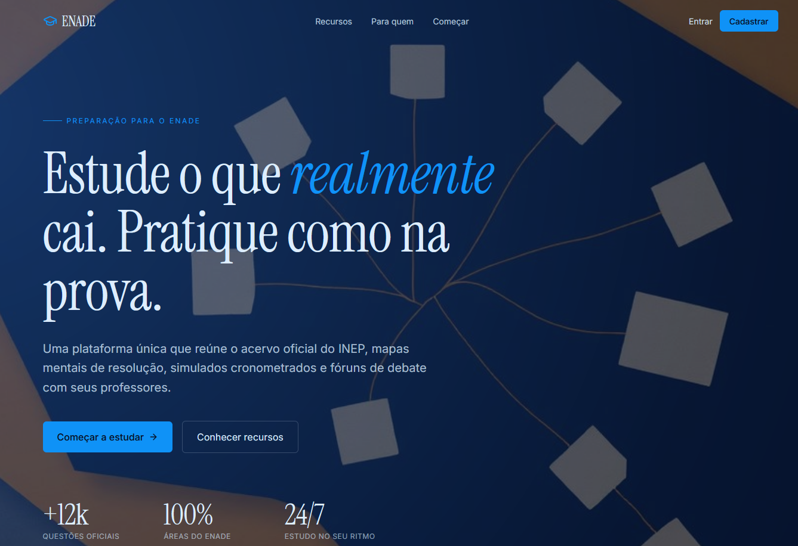
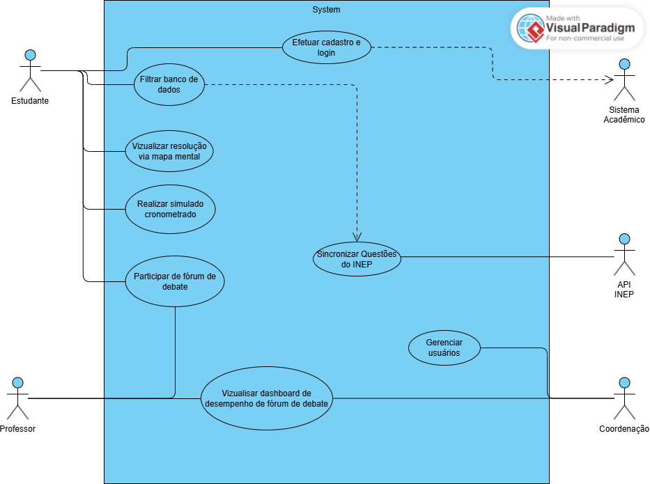
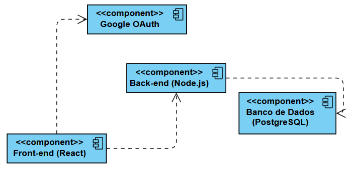
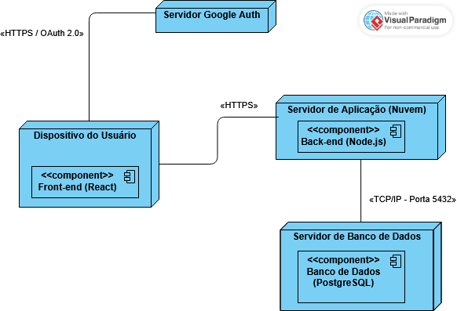
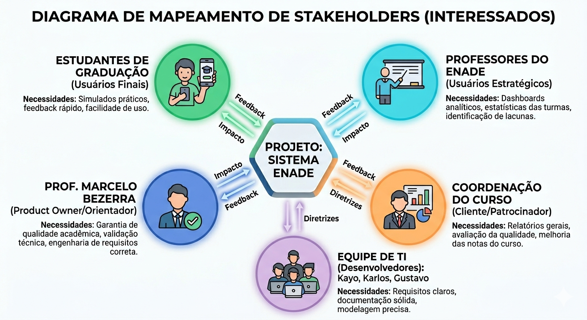

# 🎓 Sistema ENADE

> Plataforma web/mobile de preparação para o **Exame Nacional de Desempenho dos Estudantes (ENADE)**, desenvolvida como projeto da disciplina de **Requisitos e Modelagem de Sistemas** — Universidade de Fortaleza (UNIFOR).

[](https://sistema-enade.lovable.app/)
[](#)
[](#)

---

## 📌 Visão Geral

O **Sistema ENADE** centraliza a preparação para o ENADE de forma **dinâmica, colaborativa e direcionada por dados**. A plataforma combina prática com questões oficiais, aprendizado visual por mapas mentais, simulados cronometrados e ferramentas analíticas para docentes e coordenação.

**Problema resolvido:** A descentralização de materiais de estudo e a escassez de indicadores de desempenho em tempo real nas instituições de ensino.

---

## 🚀 Demonstração

Acesse o protótipo funcional: **[sistema-enade.lovable.app](https://sistema-enade.lovable.app/)**

[](https://sistema-enade.lovable.app/)

---

## ✨ Funcionalidades Principais

| Funcionalidade                | Descrição                                                     | Ator                      |
| ----------------------------- | --------------------------------------------------------------- | ------------------------- |
| 🔐 Cadastro e Login           | Autenticação integrada ao Sistema Acadêmico da instituição | Estudante                 |
| 🔍 Filtrar Banco de Questões | Busca avançada por área, ano, tipo e competência             | Estudante                 |
| 🗺️ Mapa Mental              | Resolução comentada de questões em formato visual            | Estudante                 |
| ⏱️ Simulado Cronometrado    | Treino em condições reais de prova com gestão de tempo       | Estudante                 |
| 💬 Fórum de Debate           | Discussão colaborativa por questão                            | Estudante / Professor     |
| 📊 Dashboard do Fórum        | Métricas de engajamento e desempenho das turmas                | Professor / Coordenação |
| 🔄 Sincronização INEP       | Importação de questões e gabaritos oficiais                  | Sistema INEP              |
| 👥 Gerenciar Usuários        | Controle de acesso de estudantes e professores                  | Coordenação             |
| 📚 Gerenciar Cursos           | Cadastro e vinculação de matrizes curriculares                | Coordenação             |
| 📝 Cadastrar Questões        | Inclusão manual de questões inéditas ou adaptadas            | Equipe de Professores     |
| 🎯 Gerenciar Competências    | Alinhamento do banco de itens com as diretrizes do MEC          | Equipe de Professores     |

---

## 👥 Equipe

**Professor Orientador / Product Owner:** Prof. Marcelo Bezerra

| Integrante                    | Matrícula |
| ----------------------------- | ---------- |
| Gustavo Viana Lima            | 20257      |
| Karlos Eduardo Sousa Pinto    | 2320262    |
| Kayo Nicholas Gomes Alcantara | 2320258    |

---

## 📁 Estrutura do Repositório

```
requisitos-2026-GRUPO.4/
│
├── docs/                          # Documentação do projeto
│   ├── 01_documento_visao.md      # Visão da demanda e proposta de valor
│   ├── 02_lista_stakeholders.md   # Partes interessadas detalhadas
│   ├── 03_glossario.md            # Glossário de termos
│   ├── 04_regras_de_negocio.md    # Regras de negócio
│   ├── 05_requisitos_funcionais.md
│   ├── 06_requisitos_nao_funcionais.md
│   ├── 07_SRS.md                  # Software Requirements Specification (IEEE 830)
│   ├── 08_revisao_consistencia.md # Relatório de revisão e consistência
│   └── 09_acesso_prototipo.md     # Guia de acesso ao protótipo
│
├── modelagem/                     # Especificações de Casos de Uso
│   ├── CDU-01_Efetuar_Cadastro_e_Login.md
│   ├── CDU-02_Filtrar_Banco_de_Dados.md
│   ├── CDU-03_Visualizar_Resolucao_Mapa_Mental.md
│   ├── CDU-04_Realizar_Simulado_Cronometrado.md
│   ├── CDU-05_Participar_Forum_Debate.md
│   ├── CDU-06_Visualizar_Dashboard_Forum.md
│   ├── CDU-07_Sincronizar_Questoes_INEP.md
│   ├── CDU-08_Gerenciar_Usuarios.md
│   ├── CDU-09_Gerenciar_Cursos.md
│   ├── CDU-10_Gerenciar_Competencias_Questoes.md
│   └── CDU-11_Cadastrar_Questoes.md
│
├── diagramas/                     # Diagramas UML
│   ├── Diagrama_Caso_de_Uso.png
│   ├── Diagrama_de_Componentes.png
│   ├── Diagrama_Implantacao.png
│   └── Diagrama_Stakeholders.png
│
├── prototipos/                    # Telas do protótipo (15 telas)
│
└── entregas/                      # PDFs das entregas acadêmicas
    ├── P1_GRUPO4.pdf
    └── P2_GRUPO4.pdf
```

---

## 📐 Diagramas

<table>
  <tr>
    <td align="center"><b>Diagrama de Casos de Uso</b></td>
    <td align="center"><b>Diagrama de Componentes</b></td>
  </tr>
  <tr>
    <td></td>
    <td></td>
  </tr>
  <tr>
    <td align="center"><b>Diagrama de Implantação</b></td>
    <td align="center"><b>Mapa de Stakeholders</b></td>
  </tr>
  <tr>
    <td></td>
    <td></td>
  </tr>
</table>

---

## 🗂️ Entregas Acadêmicas

| Entrega      | Descrição                                                                                               | Arquivo                              |
| ------------ | --------------------------------------------------------------------------------------------------------- | ------------------------------------ |
| **P1** | Visão da demanda, stakeholders, requisitos funcionais e não funcionais, glossário e regras de negócio | [P1_GRUPO4.pdf](entregas/P1_GRUPO4.pdf) |
| **P2** | Modelagem de casos de uso (CDU-01 a CDU-11), SRS (IEEE 830), protótipos e revisão de consistência      | [P2_GRUPO4.pdf](entregas/P2_GRUPO4.pdf) |

---

## 🛠️ Disciplina e Contexto

- **Disciplina:** Requisitos e Modelagem de Sistemas
- **Instituição:** Universidade de Fortaleza — UNIFOR
- **Semestre:** 2026.1
- **Metodologia:** Documento de Visão · SRS IEEE 830 · UML · Prototipação
