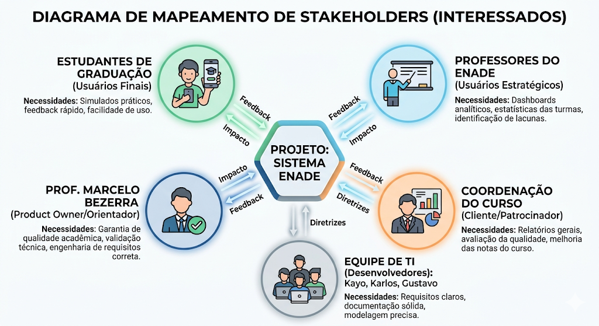

# Identificação de Stakeholders

## Histórico de Versões

| Data       | Versão | Descrição                                    | Autor                          |
| ---------- | ------- | ---------------------------------------------- | ------------------------------ |
| 01/05/2026 | 1.0     | Criação do documento e mapeamento de perfis. | Kayo Gomes Karlos Eduardo |

---

## 1. Introdução

Este documento tem como objetivo identificar, classificar e descrever todas as partes interessadas (stakeholders) envolvidas no sistema de apoio ao ENADE. O mapeamento correto garante que os requisitos elicitados atendam às reais necessidades dos usuários finais e aos objetivos de negócio da instituição de ensino.

## 2. Matriz de Stakeholders

A tabela abaixo classifica os envolvidos de acordo com seu papel, nível de influência no projeto (poder de decisão) e nível de impacto (o quanto o sistema afeta sua rotina).

| Stakeholder / Nome                                 | Papel                  | Interesses e Expectativas                                                                                                        | Influência | Impacto |
| :------------------------------------------------- | :--------------------- | :------------------------------------------------------------------------------------------------------------------------------- | :---------: | :-----: |
| **Product Owner** Prof. Marcelo Bezerra | Validador / Orientador | Garantir a aplicação correta da engenharia de requisitos, validar entregas e garantir o valor acadêmico do projeto.           |    Alta    |  Alto  |
| **Coordenação do Curso**                   | Cliente / Patrocinador | Deseja relatórios gerais de desempenho para avaliar a qualidade do ensino e melhorar as notas do curso no ENADE.                |    Alta    |  Alto  |
| **Professores do ENADE**                     | Usuário Estratégico  | Precisam de painéis analíticos (dashboards) para identificar lacunas de aprendizado nas turmas e direcionar aulas de revisão. |   Média   |  Alto  |
| **Estudantes de Graduação**                | Usuário Final         | Buscam uma ferramenta intuitiva, rápida e focada, com simulados cronometrados e mapas mentais para otimizar o tempo de estudo.  |    Baixa    |  Alto  |
| **Equipe de TI**                             | Desenvolvedores        | Precisam de requisitos claros, bem definidos e regras de negócio documentadas para a modelagem do sistema.                      |    Alta    | Médio |

---

## 3. Descrição Detalhada dos Perfis (Personas)

Para guiar as decisões de interface e fluxos do sistema, foram elaboradas personas baseadas no público-alvo principal.

### 3.1. Persona 1: O Estudante

* **Nome Fictício:** João
* **Perfil:** Aluno do 9º semestre de Ciência da Computação, estagia 6 horas por dia e tem pouco tempo livre para estudar para o ENADE.
* **Dores:** Dificuldade em organizar o vasto volume de conteúdo da graduação. Sente frustração e falta de engajamento ao ter que reler dezenas de PDFs e slides antigos, buscando um método de estudo mais ágil e visual.
* **Necessidades no Sistema:** Quer resolver questões de provas anteriores pelo celular/computador com facilidade.
  * Precisa realizar simulados focados em tópicos específicos e receber sugestões direcionadas de conteúdos para revisar e reforçar suas dificuldades.
  * Deseja testar seu tempo de resolução com simulados cronometrados.

### 3.2. Persona 2: A Professora

* **Nome Fictício:** Profa. Maria
* **Perfil:** Coordenadora de TCC e professora da disciplina de revisão para o ENADE. Leciona para múltiplas turmas.
* **Dores:** Dificuldade em acompanhar o progresso contínuo das turmas. O uso de listas estáticas em PDF impede a identificação de quais questões os alunos mais erram antes das avaliações presenciais.
* **Necessidades no Sistema:**
  * Precisa de um *Dashboard* que mostre estatísticas em tempo real (ex: "70% da Turma A errou a questão sobre Banco de Dados").
  * Quer poder interagir com os alunos no fórum de discussão de questões específicas para tirar dúvidas pontuais.

---

## 4. Estratégia de Engajamento

Para garantir o sucesso da elicitação de requisitos, a interação com esses stakeholders ocorrerá da seguinte forma:

* **Estudantes:** Serão engajados através de questionários online e entrevistas curtas para validar o modelo de mapas mentais e simulados.
* **Professores/Coordenação:** Serão entrevistados para definir quais métricas são essenciais no Dashboard analítico.
* **Product Owner:** Validação contínua através das entregas das *Sprints* no repositório.

---

## 5. Mapa Visual de Stakeholders

Para facilitar a visualização das interações e necessidades de cada grupo, o diagrama abaixo ilustra como os diferentes atores se conectam ao ecossistema do projeto:

*Figura 1: Mapeamento de influência e necessidades dos interessados.*